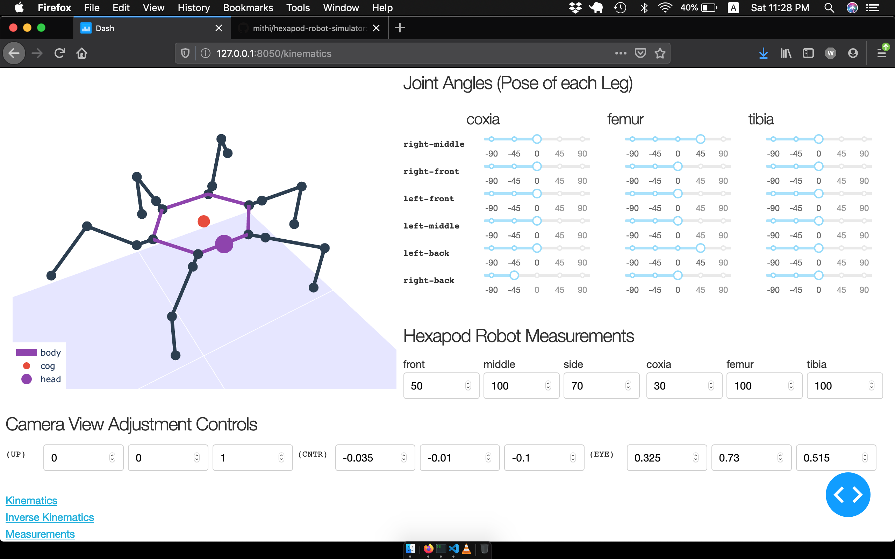
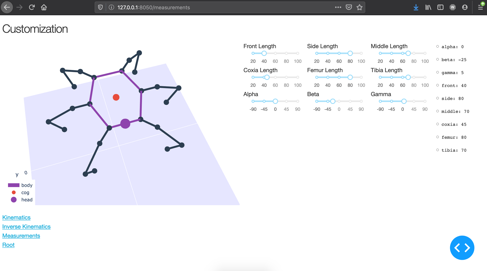
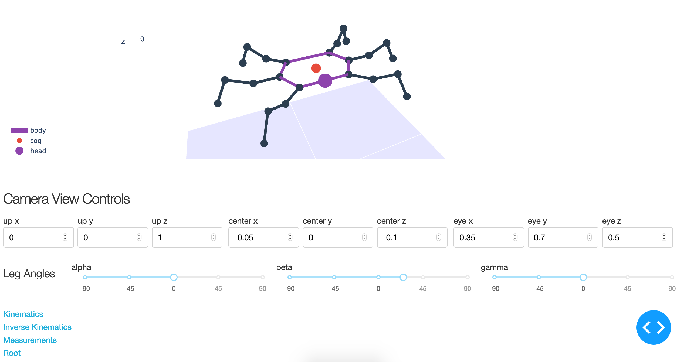

# hexapod-robot-simulator
- Hexapod robot simulator using plotly dash
- Still a work in progress

# Requirements
- Python 3
- Plotly 4
- Plotly Dash
- Numpy

# Run
```
$ python index.py
```

# Screenshots
|  |  |  |
| ------------- |:-------------:| -----:|
|  |  |  |

