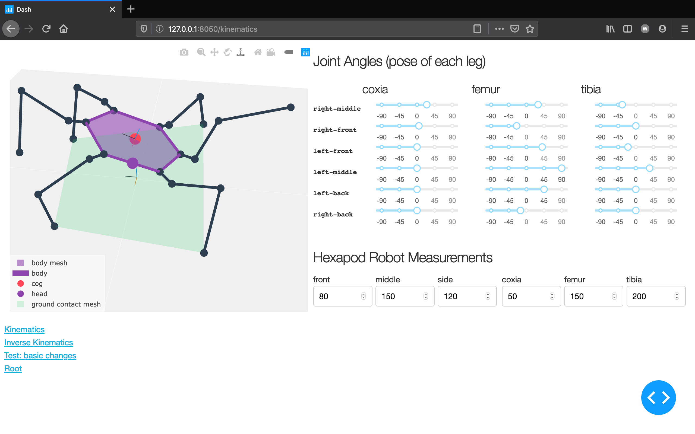
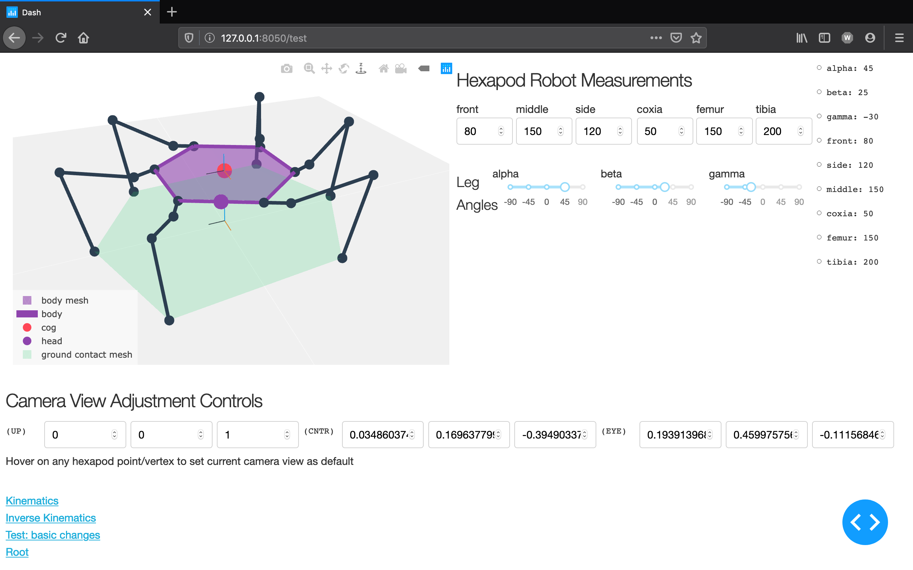
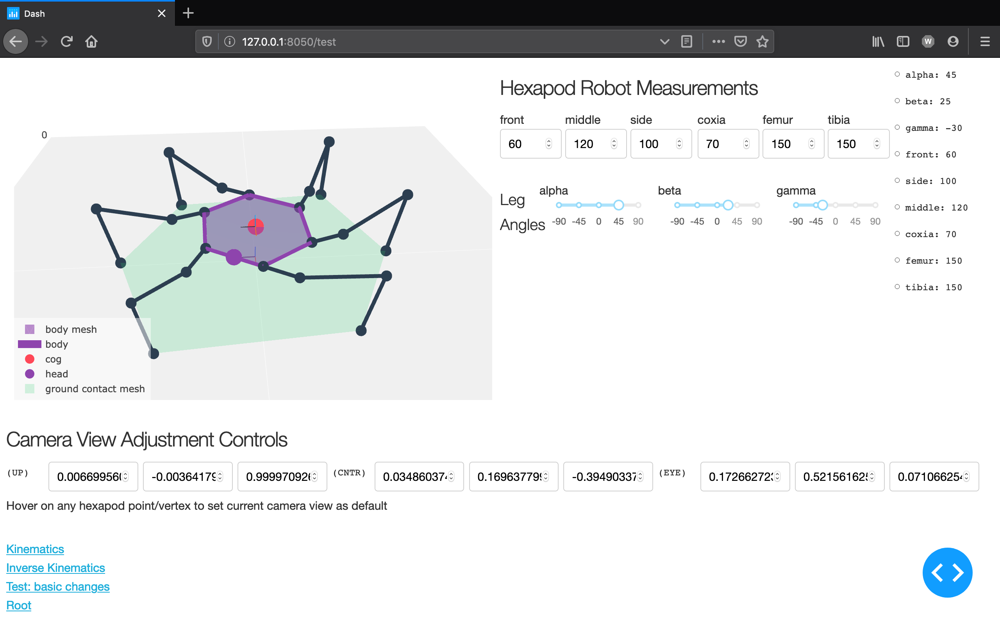

# hexapod-robot-simulator
- Hexapod robot simulator built from first principles

# Requirements
- Python 3.8.1
- Plotly Dash 1.10.0
- Numpy 1.18.1

# Run
```
$ python index.py
```

# KNOWN ISSUES
  - Leg can criss-cross each other which shouldn't be the case, I'm open to hearing ideas on how to go about this
  - Some unstable poses are not marked as unstable, by the hexapod or the inverse kinematics solver
  - When the right-middle leg is twisted by itself, the figure point of view changes, other legs don't do this
  - See other issues [here](https://github.com/mithi/hexapod-robot-simulator/issues)

# Changing global variables
- See [./CUSTOMIZE.md](./CUSTOMIZE.md) for more information

# Screenshots
|  |  |
| ------------- |:-------------:|
|  |  |
